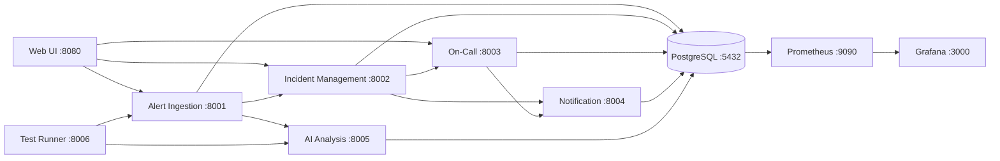
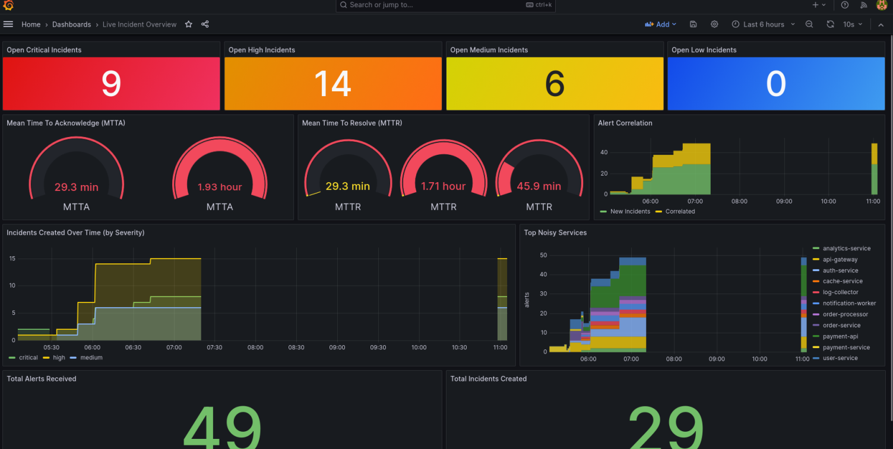
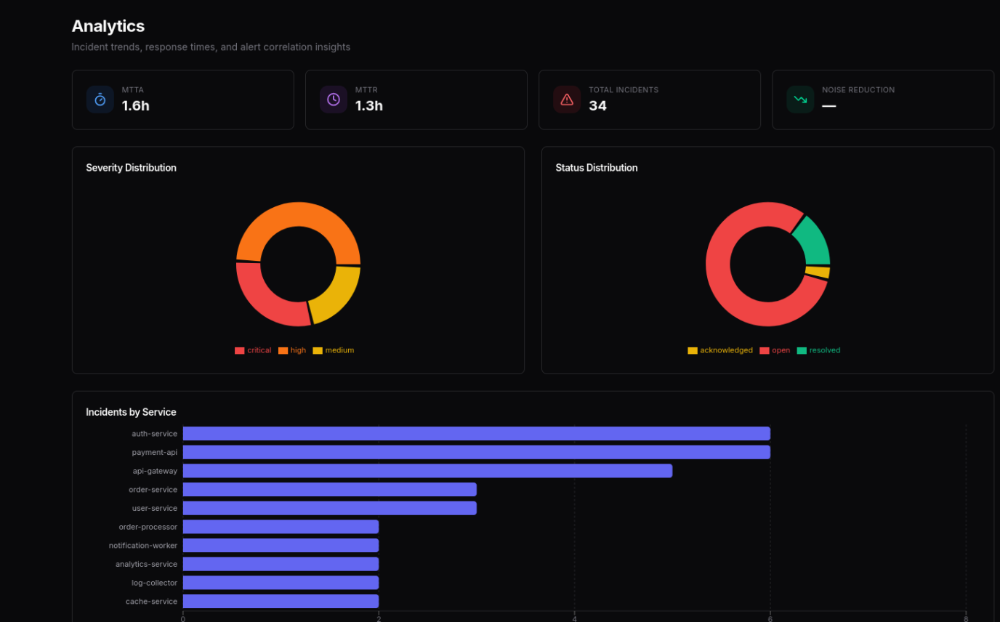
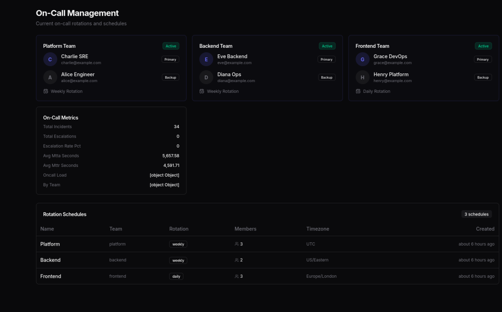
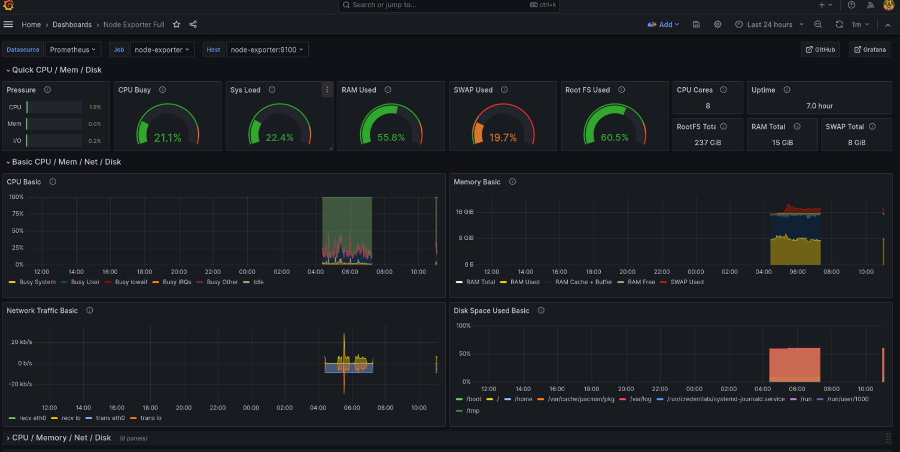
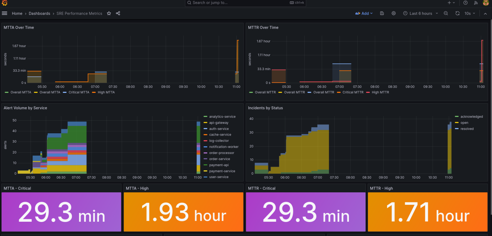
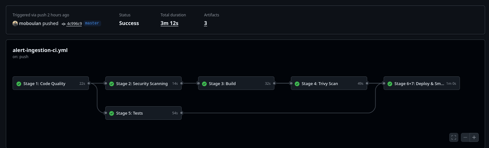
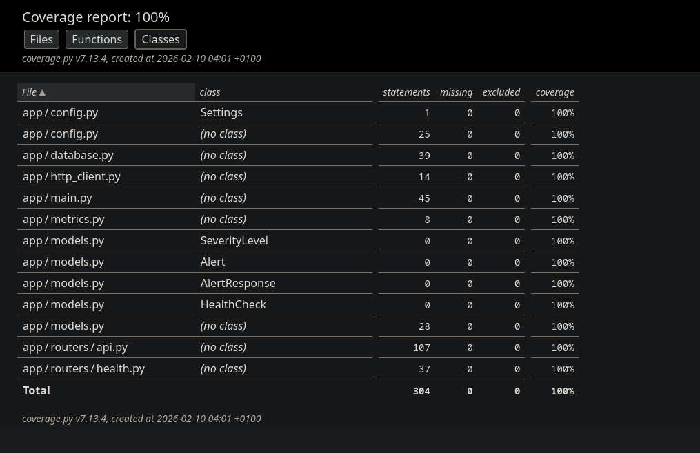
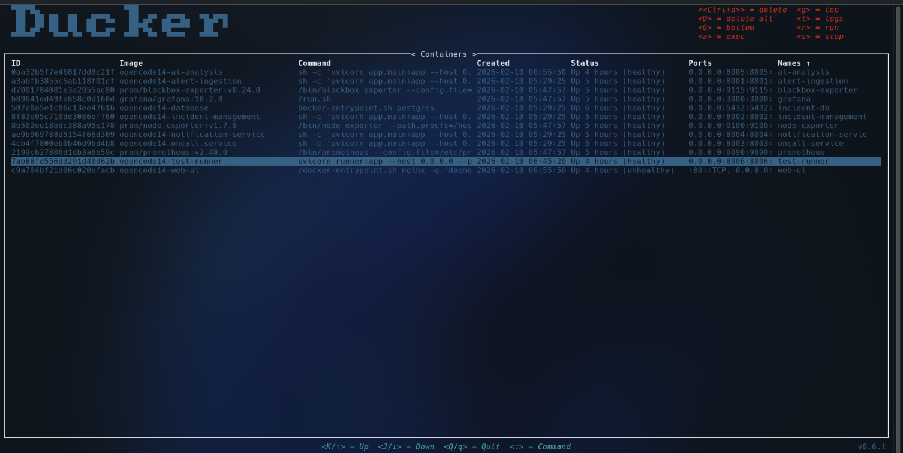

# Documentation Index

Detailed documentation for every component of the Incident & On-Call Management Platform.

## Architecture Overview



## Services

| Component | Port | Doc | Description |
| :--- | :--- | :--- | :--- |
| Alert Ingestion | 8001 | [alert-ingestion-service.md](alert-ingestion-service.md) | Receives, validates, stores, and correlates alerts |
| Incident Management | 8002 | [incident-management-service.md](incident-management-service.md) | Incident lifecycle, MTTA/MTTR, on-call assignment |
| On-Call & Escalation | 8003 | [oncall-service.md](oncall-service.md) | Rotation schedules, current on-call, auto-escalation |
| Notification | 8004 | [notification-service.md](notification-service.md) | Multi-channel notifications (mock, email, webhook) |
| AI Analysis | 8005 | [ai-analysis-service.md](ai-analysis-service.md) | NLP-powered root-cause analysis (TF-IDF + knowledge base) |
| Web UI | 8080 | [web-ui.md](web-ui.md) | React dashboard with live incident view |
| Test Runner | 8006 | [test-runner.md](test-runner.md) | Interactive test harness for sending alerts |
| Database | 5432 | [database.md](database.md) | PostgreSQL with schema-level service isolation |

## Data Flow

```
External Alert → Alert Ingestion → Correlation → Incident Management → On-Call Assignment → Notification
                       ↓                              ↑
                 AI Analysis                     Status Transitions
              (root-cause suggestions)            (MTTA/MTTR)
```

1. **Alert Ingestion** receives and validates alerts, then correlates against open incidents
2. **Incident Management** owns the incident lifecycle (open → acknowledged → resolved)
3. **On-Call Service** determines who to assign based on rotation schedules
4. **Notification Service** dispatches alerts to assigned engineers
5. **AI Analysis** provides root-cause suggestions via TF-IDF similarity
6. **Web UI** surfaces everything through a React dashboard
7. **PostgreSQL** provides persistent storage with schema separation
8. **Prometheus + Grafana** collect and visualize operational metrics

## Screenshots

| Screenshot | Description |
| :--- | :--- |
|  | Live incident dashboard with critical alerts |
|  | Incident analytics and trends |
|  | On-call schedule management |
|  | Grafana system health dashboard |
|  | SRE performance metrics dashboard |
|  | CI/CD pipeline execution |
|  | Test coverage report |
|  | Docker container architecture |
