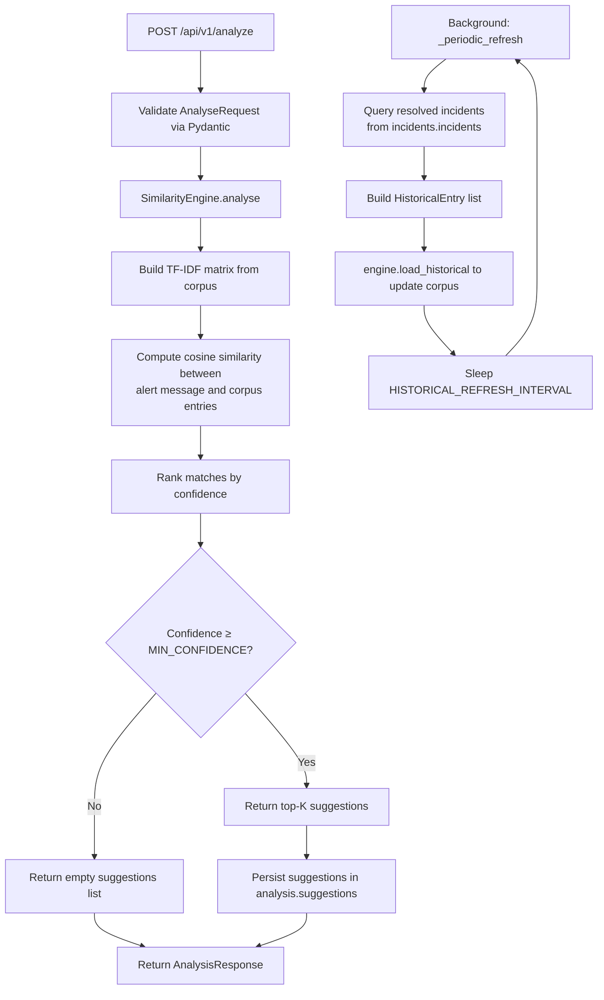

# AI Analysis Service

FastAPI microservice (port 8005) that provides NLP-powered root-cause analysis for incoming alerts. Uses a TF-IDF similarity engine to compare alert messages against a static knowledge base of SRE patterns and historical resolved incidents fetched from PostgreSQL. Suggestions are persisted in the `analysis` schema and served to the Web UI.

## Logic Flow



## Purpose

Performs TF-IDF cosine-similarity analysis on alert messages against a combined corpus of static SRE knowledge-base patterns and historical resolved incidents, returning ranked root-cause suggestions with confidence scores.

## Configuration

| Variable | Description | Required |
| :--- | :--- | :--- |
| `DATABASE_URL` | PostgreSQL connection string | Yes |
| `SERVICE_PORT` | HTTP listen port | No (default: `8005`) |
| `INCIDENT_SERVICE_URL` | Base URL of the Incident Management Service | No (default: `http://incident-management:8002`) |
| `MIN_CONFIDENCE` | Minimum cosine-similarity threshold for suggestions | No (default: `0.12`) |
| `TOP_K_SUGGESTIONS` | Maximum number of suggestions returned per analysis | No (default: `5`) |
| `HISTORICAL_REFRESH_INTERVAL` | Seconds between historical corpus refreshes | No (default: `300`) |

## Endpoints

| Method | Path | Description | Status Codes |
| :--- | :--- | :--- | :--- |
| `POST` | `/api/v1/analyze` | Analyse an alert message and return root-cause suggestions | `200`, `422`, `503` |
| `GET` | `/api/v1/suggestions` | List stored suggestions by `alert_id` or `incident_id` | `200`, `400`, `500` |
| `GET` | `/api/v1/knowledge-base` | Return all static knowledge-base patterns | `200` |
| `POST` | `/api/v1/learn` | Store a resolved pattern for future matching | `201`, `400`, `500` |
| `GET` | `/health` | Health check (database connectivity, corpus stats) | `200` |
| `GET` | `/metrics` | Prometheus metrics endpoint | `200` |

## Prometheus Metrics

| Metric | Type | Labels | Description |
| :--- | :--- | :--- | :--- |
| `http_requests_total` | Counter | `method`, `handler`, `status` | Total HTTP requests |
| `http_request_duration_seconds` | Histogram | `method`, `handler` | Request latency distribution |

## NLP Engine

The `SimilarityEngine` builds a combined corpus from two sources:

1. **Static knowledge base** — ~35 curated SRE patterns covering CPU, memory, disk, network, database, deployment, security, and application failure modes.
2. **Historical incidents** — Resolved/closed incidents fetched from `incidents.incidents` and refreshed every `HISTORICAL_REFRESH_INTERVAL` seconds.

**Algorithm:**

1. Tokenize and normalize the alert message.
2. Build a TF-IDF matrix from the combined corpus.
3. Compute pairwise cosine similarity between the alert vector and every corpus entry.
4. Return the top-K entries exceeding `MIN_CONFIDENCE`.

## Data Model

```
analysis.suggestions
├── id               SERIAL (PK)
├── alert_id         VARCHAR(255)
├── incident_id      VARCHAR(255)
├── alert_message    TEXT
├── alert_service    VARCHAR(255)
├── alert_severity   VARCHAR(50)
├── root_cause       TEXT
├── solution         TEXT
├── confidence       FLOAT
├── source           VARCHAR(50)
├── matched_pattern  TEXT
└── created_at       TIMESTAMPTZ

analysis.resolved_patterns
├── pattern_id       SERIAL (PK)
├── service          VARCHAR(255)
├── severity         VARCHAR(50)
├── message_pattern  TEXT
├── root_cause       TEXT
├── solution         TEXT
└── created_at       TIMESTAMPTZ
```
