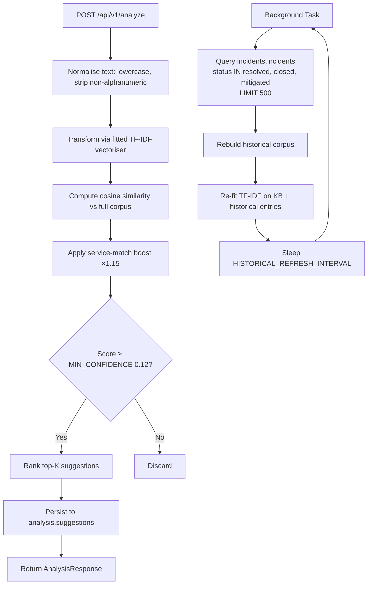

# AI Analysis Service

FastAPI microservice (port 8005) providing NLP-powered root-cause analysis for incoming alerts. Compares alert messages against two corpora using **TF-IDF + cosine similarity**: a curated static knowledge base of 20 SRE patterns and a dynamic historical corpus of resolved incidents fetched from PostgreSQL. Returns ranked root-cause suggestions with remediation steps.

<p align="center">
  
</p>

## Logic Flow



## Purpose

Analyses alert messages using TF-IDF similarity against a static knowledge base and historical resolved incidents, returning ranked root-cause suggestions and remediation steps. Persists suggestions so the Web UI can retrieve them for each incident.

## Configuration

| Variable | Description | Required |
| :--- | :--- | :--- |
| `DATABASE_URL` | PostgreSQL connection string | Yes |
| `SERVICE_PORT` | HTTP listen port | No (default: `8005`) |
| `INCIDENT_SERVICE_URL` | Base URL of Incident Management (declared, not actively called — data fetched directly from DB) | No (default: `http://incident-management:8002`) |
| `MIN_CONFIDENCE` | Minimum cosine-similarity score to include a suggestion | No (default: `0.12`) |
| `TOP_K_SUGGESTIONS` | Maximum suggestions returned per analysis | No (default: `5`) |
| `HISTORICAL_REFRESH_INTERVAL` | Seconds between historical corpus refreshes | No (default: `300`) |

## Endpoints

| Method | Path | Description | Status Codes |
| :--- | :--- | :--- | :--- |
| `POST` | `/api/v1/analyze` | Analyse an alert message and return ranked suggestions | `200`, `503` |
| `GET` | `/api/v1/suggestions` | Retrieve stored suggestions by `alert_id` or `incident_id` | `200`, `400`, `500` |
| `GET` | `/api/v1/knowledge-base` | List all static knowledge-base patterns | `200` |
| `POST` | `/api/v1/learn` | Store a new resolved pattern for future matching | `201`, `400`, `500` |
| `GET` | `/health` | Health check (DB connectivity, corpus size, KB count) | `200` |
| `GET` | `/metrics` | Prometheus metrics endpoint | `200` |

### Request / Response Examples

**`POST /api/v1/analyze`**

```json
// Request
{
  "alert_id": "abc-123",
  "incident_id": "inc-456",
  "message": "high cpu usage detected on web-server",
  "service": "web-server",
  "severity": "critical"
}

// Response
{
  "alert_id": "abc-123",
  "incident_id": "inc-456",
  "suggestions": [
    {
      "root_cause": "CPU spike due to runaway process or resource contention",
      "solution": "1. Identify top processes (top/htop) ...",
      "confidence": 0.87,
      "source": "knowledge_base",
      "matched_pattern": "high cpu usage spike process"
    }
  ],
  "analysed_at": "2025-01-15T12:00:00Z"
}
```

**`GET /api/v1/suggestions?incident_id=inc-456`** — returns stored suggestions for that incident.

**`POST /api/v1/learn?service=web-server&severity=critical&message_pattern=OOM+killed&root_cause=...&solution=...`** — stores a new resolved pattern.

## NLP Engine

### TF-IDF + Cosine Similarity Pipeline

1. **Text normalisation** — lowercase, strip all non-alphanumeric characters, collapse whitespace.
2. **Corpus construction** — knowledge-base pattern strings first, then historical entry strings (title + description + service + severity + notes concatenated).
3. **Vectorisation** — `TfidfVectorizer(stop_words="english", ngram_range=(1,2), max_features=5000)`.
4. **Query** — incoming alert message is normalised, transformed, then cosine similarity is computed against the full TF-IDF matrix.
5. **Ranking** — indices sorted by descending score; results below `MIN_CONFIDENCE` are discarded; up to `TOP_K_SUGGESTIONS` returned.
6. **Service boost** — if the alert's `service` matches a knowledge-base entry's `service_hint`, the score is multiplied by **1.15** (capped at 1.0).

### Knowledge Base

20 curated SRE patterns in `app/knowledge_base.py`, each with:

| Field | Description |
| :--- | :--- |
| `pattern` | Normalised text for TF-IDF matching |
| `service_hint` | Optional service name for score boosting |
| `root_cause` | Human-readable root-cause description |
| `solution` | Step-by-step remediation |
| `tags` | Category tags |

**Categories covered:** CPU/compute (2), memory (2), disk (1), network/connectivity (4), database (3), application errors (3), SSL/TLS/auth (2), Kubernetes (2), queue/messaging (1).

### Historical Corpus Refresh

- **On startup**: fetch up to 500 resolved/closed/mitigated incidents from `incidents.incidents`.
- **Background loop**: every `HISTORICAL_REFRESH_INTERVAL` seconds (default 300s), re-fetch and rebuild the TF-IDF index.
- **Resolution text**: uses the last note in the JSONB `notes` array as the resolution description.

## Prometheus Metrics

Auto-instrumented via `prometheus-fastapi-instrumentator`:

| Metric | Type | Labels | Description |
| :--- | :--- | :--- | :--- |
| `http_requests_total` | Counter | `method`, `handler`, `status` | Total HTTP requests |
| `http_request_duration_seconds` | Histogram | `method`, `handler` | Request latency distribution |
| `http_requests_in_progress` | Gauge | `method`, `handler` | Currently in-flight requests |

## Data Model

### `analysis.suggestions`

| Column | Type | Notes |
| :--- | :--- | :--- |
| `suggestion_id` | `SERIAL PK` | Auto-increment |
| `alert_id` | `UUID` | Nullable |
| `incident_id` | `UUID` | Nullable |
| `alert_message` | `TEXT NOT NULL` | Truncated to 500 chars |
| `alert_service` | `VARCHAR(200)` | |
| `alert_severity` | `VARCHAR(20)` | |
| `root_cause` | `TEXT NOT NULL` | |
| `solution` | `TEXT NOT NULL` | |
| `confidence` | `REAL NOT NULL` | Default `0.0` |
| `source` | `VARCHAR(50) NOT NULL` | `knowledge_base` or `historical` |
| `matched_pattern` | `TEXT` | |
| `created_at` | `TIMESTAMPTZ` | Default `NOW()` |

Indexes: `alert_id`, `incident_id`, `created_at DESC`.

### `analysis.resolved_patterns`

| Column | Type | Notes |
| :--- | :--- | :--- |
| `pattern_id` | `SERIAL PK` | Auto-increment |
| `service` | `VARCHAR(200)` | |
| `severity` | `VARCHAR(20)` | |
| `message_pattern` | `TEXT NOT NULL` | |
| `root_cause` | `TEXT NOT NULL` | |
| `solution` | `TEXT NOT NULL` | |
| `occurrence_count` | `INTEGER` | Default `1` |
| `last_seen` | `TIMESTAMPTZ` | Default `NOW()` |
| `created_at` | `TIMESTAMPTZ` | Default `NOW()` |

Index: `service`.

### Read-only dependency: `incidents.incidents`

Background refresh queries resolved/closed/mitigated incidents (up to 500 rows) for columns: `incident_id`, `title`, `description`, `service`, `severity`, `status`, `notes`, `assigned_to`.

## Inter-Service Communication

| Direction | Target | Method | Purpose |
| :--- | :--- | :--- | :--- |
| Inbound | Alert Ingestion | receives `POST /api/v1/analyze` | Analyse an alert and return suggestions |
| Inbound | Web UI | receives `GET /api/v1/suggestions`, `GET /api/v1/knowledge-base` | Frontend fetches stored suggestions and KB patterns |
| Outbound | PostgreSQL (direct) | `psycopg2` pool | Read `incidents.incidents`; write `analysis.suggestions` and `analysis.resolved_patterns` |
