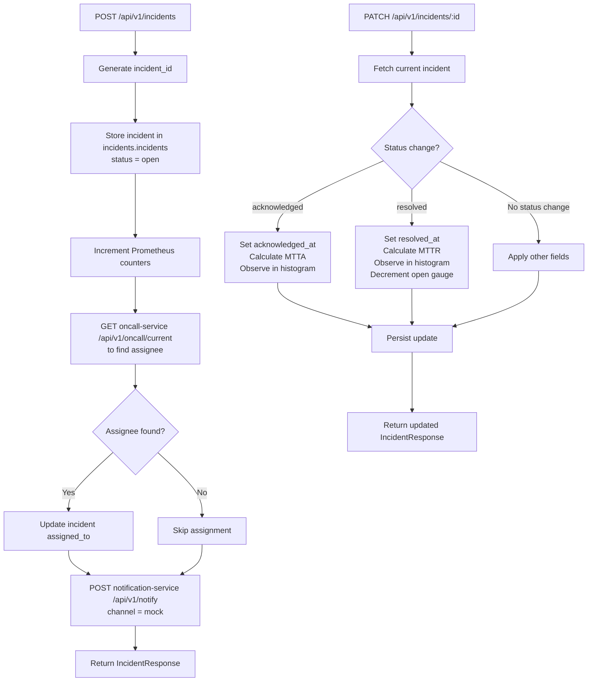

# Incident Management Service

FastAPI microservice (port 8002) that owns the incident lifecycle from creation through resolution. It tracks status transitions (open, acknowledged, resolved), calculates MTTA and MTTR as Prometheus histograms, assigns on-call engineers via the On-Call Service, and dispatches notifications via the Notification Service.

## Logic Flow



## Purpose

Manages the full incident lifecycle (open, acknowledged, resolved) including MTTA/MTTR calculation, on-call assignment via the On-Call Service, and notification dispatch via the Notification Service.

## Configuration

| Variable | Description | Required |
| :--- | :--- | :--- |
| `DATABASE_URL` | PostgreSQL connection string | Yes |
| `SERVICE_NAME` | Service identifier | No (default: `incident-management`) |
| `SERVICE_PORT` | HTTP listen port | No (default: `8002`) |
| `ENVIRONMENT` | Runtime environment label | No (default: `development`) |
| `APP_VERSION` | Reported application version | No (default: `1.0.0`) |
| `DB_POOL_MIN` | Minimum database connections in pool | No (default: `1`) |
| `DB_POOL_MAX` | Maximum database connections in pool | No (default: `10`) |
| `ESCALATION_TIMEOUT_MINUTES` | Minutes before escalation trigger | No (default: `5`) |
| `HTTP_CLIENT_TIMEOUT` | Timeout in seconds for outbound HTTP calls | No (default: `10.0`) |
| `HEALTH_MEMORY_THRESHOLD` | Memory usage percentage triggering degraded health | No (default: `90.0`) |
| `HEALTH_DISK_THRESHOLD` | Disk usage percentage triggering degraded health | No (default: `90.0`) |
| `CORS_ORIGINS` | Comma-separated allowed CORS origins | No (default: `http://localhost:8080,http://localhost:3000`) |
| `ONCALL_SERVICE_URL` | Base URL of the On-Call Service | No (default: `http://oncall-service:8003`) |
| `NOTIFICATION_SERVICE_URL` | Base URL of the Notification Service | No (default: `http://notification-service:8004`) |
| `ALERT_SERVICE_URL` | Base URL of the Alert Ingestion Service | No (default: `http://alert-ingestion:8001`) |
| `MTTA_BUCKETS` | Comma-separated histogram bucket boundaries for MTTA | No (default: `30,60,120,300,600,1800,3600`) |
| `MTTR_BUCKETS` | Comma-separated histogram bucket boundaries for MTTR | No (default: `300,600,1800,3600,7200,14400,28800`) |
| `LOG_LEVEL` | Python logging level | No (default: `INFO`) |

## Endpoints

| Method | Path | Description | Status Codes |
| :--- | :--- | :--- | :--- |
| `POST` | `/api/v1/incidents` | Create a new incident | `201`, `422` |
| `GET` | `/api/v1/incidents` | List incidents with `status`, `severity`, `service`, `limit`, `offset` filters | `200` |
| `GET` | `/api/v1/incidents/analytics` | Historical aggregates (counts, avg MTTA/MTTR, breakdowns) | `200` |
| `GET` | `/api/v1/incidents/{incident_id}` | Retrieve a single incident with linked alerts | `200`, `404` |
| `PATCH` | `/api/v1/incidents/{incident_id}` | Update status, assignee, or append notes | `200`, `400`, `404` |
| `GET` | `/health` | Full health check (database, memory, disk) | `200`, `503` |
| `GET` | `/health/ready` | Readiness probe | `200`, `503` |
| `GET` | `/health/live` | Liveness probe | `200` |
| `GET` | `/metrics` | Prometheus metrics endpoint | `200` |

## Prometheus Metrics

| Metric | Type | Labels | Description |
| :--- | :--- | :--- | :--- |
| `incidents_total` | Counter | `status`, `severity` | Total incidents by status and severity |
| `oncall_notifications_sent_total` | Counter | `channel`, `status` | Notifications sent from this service |
| `incident_mtta_seconds` | Histogram | `severity` | Time to acknowledge incidents (seconds) |
| `incident_mttr_seconds` | Histogram | `severity` | Time to resolve incidents (seconds) |
| `open_incidents` | Gauge | `severity` | Current number of open incidents |

## Data Model

```
incidents.incidents
├── id              UUID (PK)
├── incident_id     VARCHAR(255) UNIQUE
├── title           VARCHAR(500)
├── description     TEXT
├── service         VARCHAR(255)
├── severity        severity_level ENUM
├── status          incident_status ENUM
├── assigned_to     UUID (FK -> users)
├── notes           JSONB (array)
├── created_at      TIMESTAMPTZ
├── acknowledged_at TIMESTAMPTZ
├── resolved_at     TIMESTAMPTZ
└── updated_at      TIMESTAMPTZ

incidents.incident_alerts (join table)
├── incident_id     UUID (FK -> incidents.incidents)
├── alert_id        UUID (FK -> alerts.alerts)
└── linked_at       TIMESTAMPTZ
```

## Inter-Service Communication

| Target Service | Method | Endpoint | Trigger |
| :--- | :--- | :--- | :--- |
| On-Call Service | `GET` | `/api/v1/oncall/current?team={service}` | Incident creation (find assignee) |
| Notification Service | `POST` | `/api/v1/notify` | Incident creation (alert on-call engineer) |
