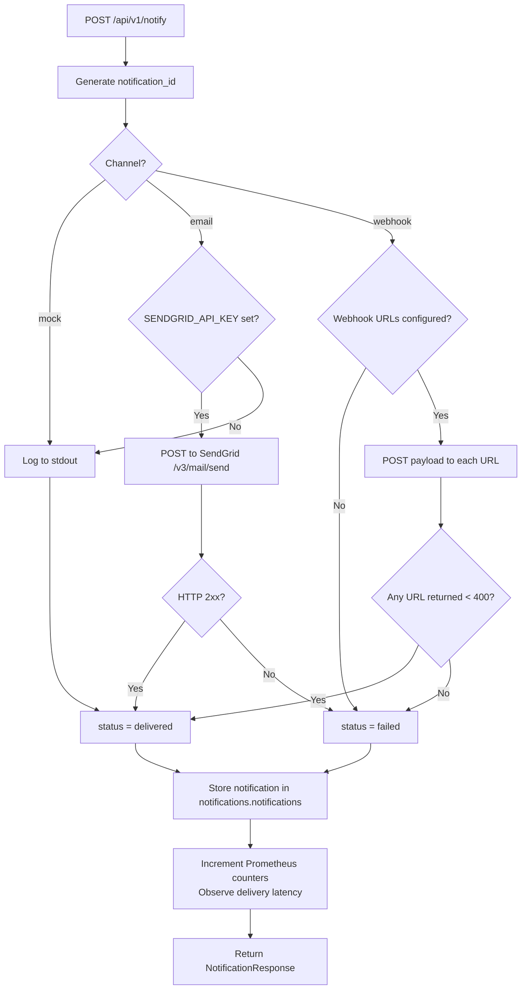

# Notification Service

FastAPI microservice (port 8004) responsible for dispatching notifications to on-call engineers. Supports three channels: mock (stdout logging), email (SendGrid API with mock fallback), and webhook (HTTP POST to configured URLs). All deliveries are persisted in PostgreSQL and instrumented with Prometheus latency histograms.

## Logic Flow



## Purpose

Dispatches notifications to engineers via configurable channels (mock, email via SendGrid, webhook) and records delivery status with latency metrics.

## Configuration

| Variable | Description | Required |
| :--- | :--- | :--- |
| `DATABASE_URL` | PostgreSQL connection string | Yes |
| `SERVICE_NAME` | Service identifier | No (default: `notification-service`) |
| `SERVICE_PORT` | HTTP listen port | No (default: `8004`) |
| `ENVIRONMENT` | Runtime environment label | No (default: `development`) |
| `APP_VERSION` | Reported application version | No (default: `1.0.0`) |
| `DB_POOL_MIN` | Minimum database connections in pool | No (default: `1`) |
| `DB_POOL_MAX` | Maximum database connections in pool | No (default: `10`) |
| `HTTP_CLIENT_TIMEOUT` | Timeout in seconds for outbound HTTP calls | No (default: `10.0`) |
| `HEALTH_MEMORY_THRESHOLD` | Memory usage percentage triggering degraded health | No (default: `90.0`) |
| `HEALTH_DISK_THRESHOLD` | Disk usage percentage triggering degraded health | No (default: `90.0`) |
| `CORS_ORIGINS` | Comma-separated allowed CORS origins | No (default: `http://localhost:8080,http://localhost:3000`) |
| `SENDGRID_API_KEY` | SendGrid API key for email delivery | No (falls back to mock) |
| `SENDGRID_FROM_EMAIL` | Sender email address for SendGrid | No (default: `noreply@incident-platform.local`) |
| `WEBHOOK_URLS` | Comma-separated webhook destination URLs | No (default: empty) |
| `LOG_LEVEL` | Python logging level | No (default: `INFO`) |

## Endpoints

| Method | Path | Description | Status Codes |
| :--- | :--- | :--- | :--- |
| `POST` | `/api/v1/notify` | Send a notification via the specified channel | `201`, `422` |
| `GET` | `/api/v1/notifications` | List notification history with `incident_id`, `channel`, `limit`, `offset` filters | `200` |
| `GET` | `/api/v1/notifications/{notification_id}` | Retrieve a single notification record | `200`, `404` |
| `GET` | `/health` | Full health check (database, memory, disk) | `200`, `503` |
| `GET` | `/health/ready` | Readiness probe | `200`, `503` |
| `GET` | `/health/live` | Liveness probe | `200` |
| `GET` | `/metrics` | Prometheus metrics endpoint | `200` |

## Prometheus Metrics

| Metric | Type | Labels | Description |
| :--- | :--- | :--- | :--- |
| `oncall_notifications_sent_total` | Counter | `channel`, `status` | Total notifications sent by channel and delivery status |
| `escalations_total` | Counter | `team` | Total escalations triggered |
| `notification_delivery_seconds` | Histogram | `channel` | Notification delivery latency (buckets: 0.1s to 10s) |

## Supported Channels

| Channel | Behavior |
| :--- | :--- |
| `mock` | Logs notification payload to stdout; always returns `delivered` |
| `email` | Sends via SendGrid API; falls back to `mock` if `SENDGRID_API_KEY` is unset |
| `webhook` | POSTs JSON payload to each configured URL; `delivered` if any URL responds with status < 400 |

## Data Model

```
notifications.notifications
├── id               UUID (PK)
├── notification_id  VARCHAR(255) UNIQUE
├── incident_id      VARCHAR(255)
├── engineer         VARCHAR(255)
├── channel          VARCHAR(50)
├── status           VARCHAR(50)
├── message          TEXT
└── created_at       TIMESTAMPTZ
```
