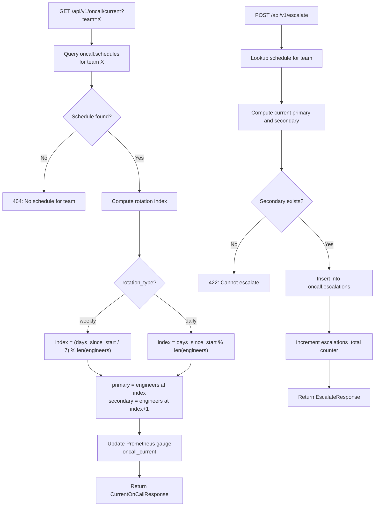

# On-Call and Escalation Service

FastAPI microservice (port 8003) that manages on-call rotation schedules, computes the current primary and secondary on-call engineers using date-offset rotation logic, and handles incident escalation when the primary engineer does not acknowledge within the configured timeout.

## Logic Flow



## Purpose

Manages on-call rotation schedules, computes the current primary and secondary on-call engineers for a given team based on date-offset rotation logic, and handles incident escalation from primary to secondary.

## Configuration

| Variable | Description | Required |
| :--- | :--- | :--- |
| `DATABASE_URL` | PostgreSQL connection string | Yes |
| `SERVICE_NAME` | Service identifier | No (default: `oncall-service`) |
| `SERVICE_PORT` | HTTP listen port | No (default: `8003`) |
| `ENVIRONMENT` | Runtime environment label | No (default: `development`) |
| `APP_VERSION` | Reported application version | No (default: `1.0.0`) |
| `DB_POOL_MIN` | Minimum database connections in pool | No (default: `1`) |
| `DB_POOL_MAX` | Maximum database connections in pool | No (default: `10`) |
| `HTTP_CLIENT_TIMEOUT` | Timeout in seconds for outbound HTTP calls | No (default: `10.0`) |
| `HEALTH_MEMORY_THRESHOLD` | Memory usage percentage triggering degraded health | No (default: `90.0`) |
| `HEALTH_DISK_THRESHOLD` | Disk usage percentage triggering degraded health | No (default: `90.0`) |
| `CORS_ORIGINS` | Comma-separated allowed CORS origins | No (default: `http://localhost:8080,http://localhost:3000`) |
| `INCIDENT_SERVICE_URL` | Base URL of the Incident Management Service | No (default: `http://incident-management:8002`) |
| `NOTIFICATION_SERVICE_URL` | Base URL of the Notification Service | No (default: `http://notification-service:8004`) |
| `DEFAULT_ESCALATION_MINUTES` | Default minutes before auto-escalation | No (default: `5`) |
| `LOG_LEVEL` | Python logging level | No (default: `INFO`) |

## Endpoints

| Method | Path | Description | Status Codes |
| :--- | :--- | :--- | :--- |
| `POST` | `/api/v1/schedules` | Create a new on-call rotation schedule | `201`, `422`, `500` |
| `GET` | `/api/v1/schedules` | List all schedules with optional `team` filter | `200`, `500` |
| `GET` | `/api/v1/oncall/current` | Get current primary and secondary on-call for a team | `200`, `404`, `500` |
| `POST` | `/api/v1/escalate` | Escalate an incident from primary to secondary on-call | `201`, `404`, `422`, `500` |
| `GET` | `/api/v1/escalations` | List escalation history with optional `incident_id` filter | `200`, `500` |
| `GET` | `/health` | Full health check (database, memory, disk) | `200`, `503` |
| `GET` | `/health/ready` | Readiness probe | `200`, `503` |
| `GET` | `/health/live` | Liveness probe | `200` |
| `GET` | `/metrics` | Prometheus metrics endpoint | `200` |

## Prometheus Metrics

| Metric | Type | Labels | Description |
| :--- | :--- | :--- | :--- |
| `escalations_total` | Counter | `team` | Total escalations triggered per team |
| `oncall_current` | Gauge | `team`, `engineer`, `role` | Current on-call status (1 = on-call) |

## Rotation Algorithm

1. Load the schedule for the requested team from `oncall.schedules`.
2. Compute `delta_days = today - start_date`.
3. For **weekly** rotation: `index = (delta_days / 7) % len(engineers)`.
4. For **daily** rotation: `index = delta_days % len(engineers)`.
5. Primary = `engineers[index]`, Secondary = `engineers[(index + 1) % len(engineers)]`.

## Data Model

```
oncall.schedules
├── id                  UUID (PK)
├── team                VARCHAR(255)
├── rotation_type       VARCHAR(50)
├── start_date          DATE
├── engineers           JSONB (array of {name, email, primary})
├── escalation_minutes  INTEGER
└── created_at          TIMESTAMPTZ

oncall.escalations
├── id              UUID (PK)
├── incident_id     VARCHAR(255)
├── from_engineer   VARCHAR(255)
├── to_engineer     VARCHAR(255)
├── reason          VARCHAR(255)
└── escalated_at    TIMESTAMPTZ
```

## Seed Data

Three pre-configured teams are seeded on database initialization:

| Team | Rotation | Engineers |
| :--- | :--- | :--- |
| `platform` | weekly | Alice Engineer, Bob Developer, Charlie SRE |
| `backend` | weekly | Diana Ops, Eve Backend |
| `frontend` | daily | Frank Frontend, Grace DevOps, Henry Platform |
