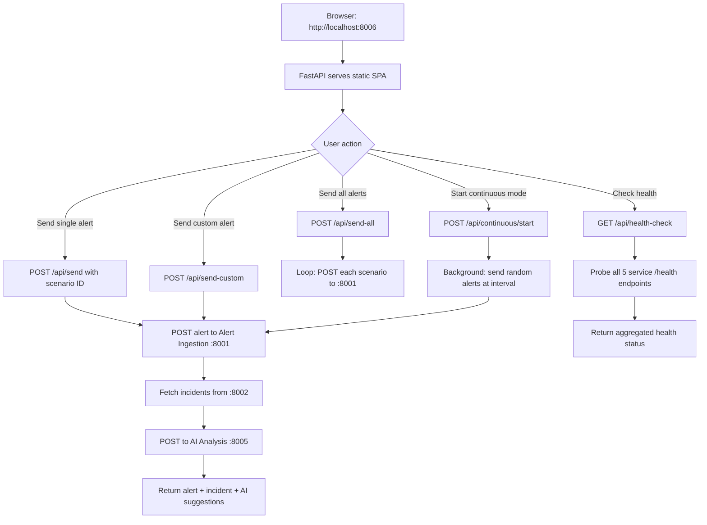

# Test Runner

FastAPI service (port 8006) that provides an interactive web UI for sending realistic test alerts to the Incident Platform. Ships 15 predefined alert scenarios grouped by category (CPU, Memory, Disk, Network, Database, Deployment, Application, Security) and supports custom freeform alerts, continuous load generation, and real-time AI analysis result viewing.

## Logic Flow

## Purpose

Interactive test data generator and service health monitor, providing a browser-based interface to exercise the full alert-to-incident-to-AI-analysis pipeline with predefined or custom alert payloads.

## Configuration

| Variable | Description | Required |
| :--- | :--- | :--- |
| `ALERT_URL` | Alert Ingestion endpoint | No (default: `http://alert-ingestion:8001/api/v1/alerts`) |
| `INCIDENT_URL` | Incident Management endpoint | No (default: `http://incident-management:8002/api/v1/incidents`) |
| `ONCALL_URL` | On-Call Service endpoint | No (default: `http://oncall-service:8003/api/v1/oncall`) |
| `AI_ANALYSIS_URL` | AI Analysis endpoint | No (default: `http://ai-analysis:8005/api/v1/analyze`) |
| `SERVICE_PORT` | HTTP listen port | No (default: `8006`) |

## Endpoints

| Method | Path | Description | Status Codes |
| :--- | :--- | :--- | :--- |
| `GET` | `/` | Serve the single-page web UI | `200` |
| `GET` | `/api/scenarios` | List all 15 predefined alert scenarios | `200` |
| `POST` | `/api/send` | Send a single predefined alert by scenario ID | `200`, `404` |
| `POST` | `/api/send-all` | Send all predefined alerts sequentially | `200` |
| `POST` | `/api/send-custom` | Send a custom alert with freeform fields | `200` |
| `POST` | `/api/continuous/start` | Start continuous load with configurable interval | `200` |
| `POST` | `/api/continuous/stop` | Stop continuous load generation | `200` |
| `GET` | `/api/continuous/status` | Check if continuous mode is active | `200` |
| `GET` | `/api/health-check` | Probe all backend services and return status | `200` |
| `GET` | `/api/history` | Retrieve recent execution history | `200` |
| `GET` | `/health` | Service health check | `200` |
| `WS` | `/ws` | WebSocket for real-time execution log streaming | — |

## Predefined Scenarios

| ID | Category | Service | Severity |
| :--- | :--- | :--- | :--- |
| `cpu-high` | CPU / Compute | payment-api | critical |
| `cpu-throttle` | CPU / Compute | auth-service | high |
| `mem-oom` | Memory | user-service | critical |
| `mem-high` | Memory | cache-service | high |
| `disk-full` | Disk | log-collector | high |
| `net-timeout` | Network | api-gateway | critical |
| `net-refused` | Network | order-service | high |
| `db-pool` | Database | user-service | critical |
| `db-slow` | Database | analytics-service | medium |
| `deploy-fail` | Deployment | checkout-service | critical |
| `deploy-config` | Deployment | notification-service | high |
| `app-5xx` | Application | frontend-api | critical |
| `app-latency` | Application | search-service | high |
| `sec-auth` | Security | auth-service | critical |
| `sec-rate` | Security | api-gateway | high |

## Technology

| Component | Technology |
| :--- | :--- |
| Backend | FastAPI + Uvicorn |
| HTTP client | httpx (async) |
| Frontend | Vanilla HTML/JS (single-page) |
| Real-time | WebSocket |
| Container | Python 3.11-slim |
