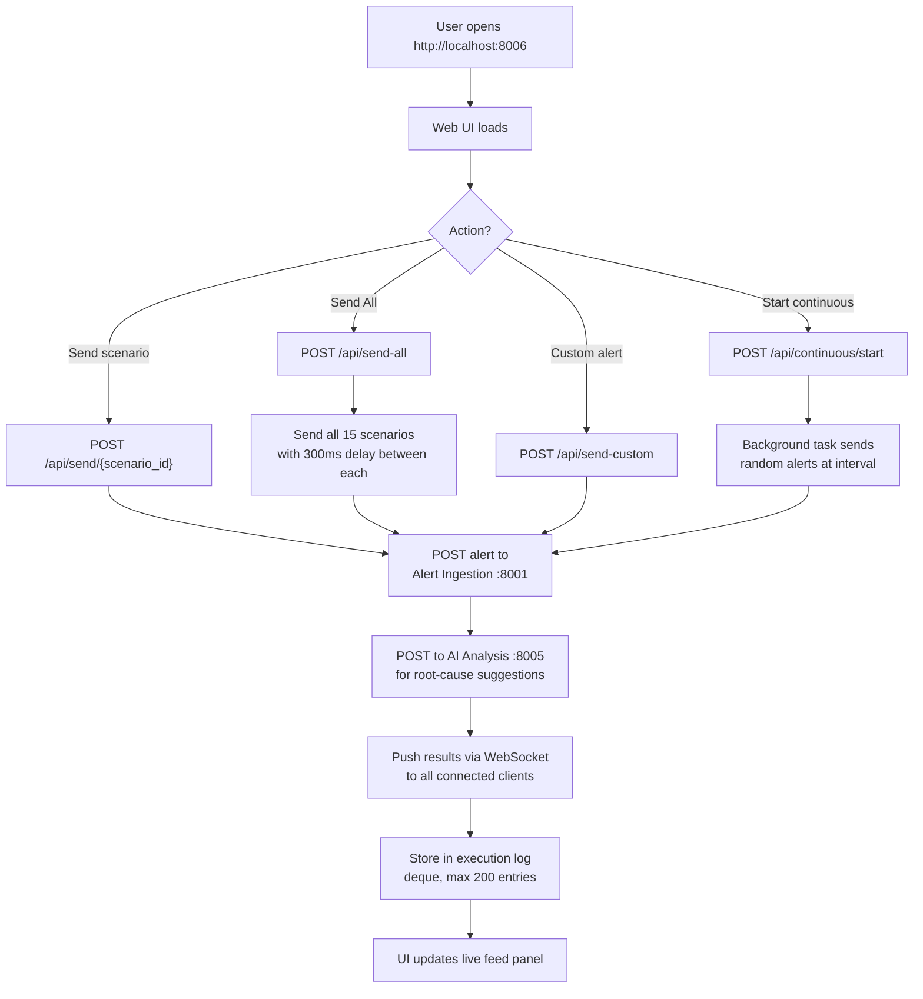

# Test Runner

Interactive web dashboard (port 8006) for sending realistic test data to the Incident Management Platform. Acts as a testing and demo tool that exercises the full alert pipeline — alert ingestion, incident creation, on-call routing, and AI analysis — without needing real monitoring infrastructure.

## Logic Flow

## Purpose

Provides an interactive web-based test harness for exercising the full incident platform pipeline with predefined or custom alert scenarios, real-time result streaming via WebSocket, and continuous mode for load/demo testing.

## Predefined Scenarios (15)

| ID | Category | Service | Severity | Message |
| :--- | :--- | :--- | :--- | :--- |
| `cpu-high` | CPU / Compute | payment-api | critical | High CPU usage detected |
| `cpu-throttle` | CPU / Compute | auth-service | high | CPU throttling detected |
| `mem-oom` | Memory | user-service | critical | OOM kill detected |
| `mem-high` | Memory | cache-service | high | High memory usage |
| `disk-full` | Disk | log-collector | high | Disk space critically low |
| `net-timeout` | Network | api-gateway | critical | Connection timeout |
| `net-refused` | Network | order-service | high | Connection refused |
| `db-pool` | Database | user-service | critical | Database connection pool exhausted |
| `db-slow` | Database | analytics-service | medium | Slow database queries |
| `http-500` | HTTP Errors | api-gateway | critical | HTTP 500 errors spike |
| `http-401` | HTTP Errors | auth-service | medium | Authentication failures spike |
| `ssl-expiry` | SSL / TLS | api-gateway | high | SSL certificate expiring soon |
| `k8s-crash` | Kubernetes | payment-api | high | CrashLoopBackOff detected |
| `k8s-hpa` | Kubernetes | notification-worker | medium | HPA scaling events |
| `queue-backlog` | Queue | order-processor | high | Message queue backlog growing |

## Configuration

| Variable | Default | Description |
| :--- | :--- | :--- |
| `ALERT_URL` | `http://alert-ingestion:8001/api/v1/alerts` | Alert ingestion endpoint |
| `INCIDENT_URL` | `http://incident-management:8002/api/v1/incidents` | Incident management endpoint |
| `ONCALL_URL` | `http://oncall-service:8003/api/v1/oncall` | On-call service endpoint |
| `AI_ANALYSIS_URL` | `http://ai-analysis:8005/api/v1/analyze` | AI analysis endpoint |
| `SERVICE_PORT` | `8006` | Port the service listens on |

## Endpoints

| Method | Path | Description |
| :--- | :--- | :--- |
| `GET` | `/` | Serves the web UI |
| `GET` | `/health` | Health check (returns scenario count) |
| `GET` | `/api/scenarios` | List all scenarios grouped by category |
| `POST` | `/api/send/{scenario_id}` | Send a single predefined scenario |
| `POST` | `/api/send-all` | Send all 15 scenarios sequentially (300ms delay) |
| `POST` | `/api/send-custom` | Send a custom alert (service, severity, message, labels) |
| `POST` | `/api/continuous/start` | Start continuous random alert generation |
| `POST` | `/api/continuous/stop` | Stop continuous mode |
| `GET` | `/api/continuous/status` | Check whether continuous mode is running |
| `GET` | `/api/health-check` | Ping all 5 platform services and report status |
| `POST` | `/api/setup-oncall` | Seed on-call schedules into the On-Call Service |
| `GET` | `/api/history` | Recent execution history (up to 200 entries) |
| `DELETE` | `/api/history` | Clear execution history |
| `WS` | `/ws` | WebSocket for live result streaming |

## Web Interface

The UI is a self-contained dark-themed single-page application (HTML + CSS + JS, no framework) served from `static/index.html`.

### Features

| Section | Description |
| :--- | :--- |
| **Header bar** | Title, Health Check button, Setup On-Call button, Send All button |
| **Health status** | 5 colored dots (green/red/grey) for each platform service, auto-refreshes every 30s |
| **Continuous mode** | Configurable interval (3–300s), start/stop toggle with animated indicator |
| **Stats row** | 4 counters: Sent (blue), AI Analysed (green), Failed (red), Total (amber) |
| **Scenarios tab** | Cards grouped by category, each showing service, severity badge, message, labels, and Send button |
| **Custom Alert tab** | Form with service, severity dropdown, message textarea, and labels JSON input |
| **Live Feed panel** | WebSocket-driven real-time event stream with color-coded entries and AI suggestions |
| **Toast notifications** | Success/error/info popups in bottom-right corner |

### On-Call Seed Data

The "Setup On-Call" button seeds these schedules:

| Team | Engineer | Email |
| :--- | :--- | :--- |
| platform | alice | alice@example.com |
| backend | bob | bob@example.com |
| frontend | charlie | charlie@example.com |
| sre | diana | diana@example.com |
| data | eve | eve@example.com |

## Inter-Service Communication

| Target Service | Method | Endpoint | Trigger |
| :--- | :--- | :--- | :--- |
| Alert Ingestion | `POST` | `/api/v1/alerts` | Every alert scenario sent |
| AI Analysis | `POST` | `/api/v1/analyze` | After each alert is sent, to get root-cause suggestions |
| On-Call Service | `POST` | `/api/v1/schedules` | Setup On-Call button |
| All services | `GET` | `/health` | Health Check button (ports 8001–8005) |

## Technology Stack

| Component | Technology |
| :--- | :--- |
| Backend | FastAPI + Uvicorn |
| HTTP client | httpx |
| WebSocket | websockets |
| Frontend | Vanilla HTML/CSS/JS (single file) |
| Container | Python 3.11-slim |
