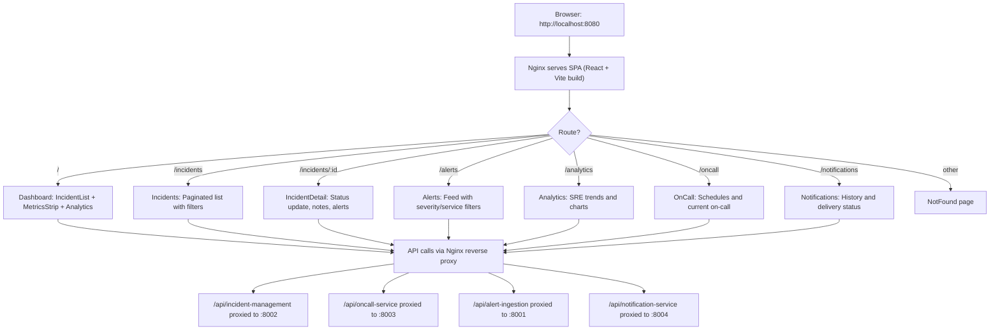

# Web UI (ExpertMind)

React 18 single-page application (port 8080) built with Vite and served via Nginx. Provides the browser-based operator interface for the incident platform, including a live dashboard, incident detail views, on-call schedule management, and SRE metrics charts. Nginx acts as a reverse proxy, routing API calls to all backend services over the Docker Compose network.

## Logic Flow



## Purpose

Single-page React application served via Nginx that provides a browser-based interface for viewing incidents, managing on-call schedules, and monitoring SRE metrics, with Nginx acting as a reverse proxy to all backend services.

## Pages

| Route | Component | Description |
| :--- | :--- | :--- |
| `/` | `Dashboard` | Incident list, live metrics strip, incident analytics |
| `/incidents` | `Incidents` | Paginated incident list with filters |
| `/incidents/:incidentId` | `IncidentDetail` | Single incident view with status transitions, notes, linked alerts |
| `/alerts` | `Alerts` | Alert feed with severity and service filters |
| `/analytics` | `Analytics` | SRE performance trends and analytics charts |
| `/oncall` | `OnCall` | On-call schedules and current engineer lookup |
| `/notifications` | `Notifications` | Notification history and delivery status |
| `/login` | `Login` | Authentication page |
| `/*` | `NotFound` | 404 fallback |

## Nginx Reverse Proxy Routes

| Location | Upstream | Protocol |
| :--- | :--- | :--- |
| `/api/alert-ingestion/` | `http://alert-ingestion:8001/` | HTTP |
| `/api/incident-management/` | `http://incident-management:8002/` | HTTP |
| `/api/oncall-service/` | `http://oncall-service:8003/` | HTTP |
| `/api/notification-service/` | `http://notification-service:8004/` | HTTP |
| `/ws/` | `http://incident-management:8002/ws/` | WebSocket |
| `/health` | Inline Nginx response | HTTP (returns static JSON) |
| `/` | Local filesystem | Static SPA files with fallback to `index.html` |

## Technology Stack

| Component | Technology |
| :--- | :--- |
| Framework | React 18 |
| Build tool | Vite |
| Routing | react-router-dom 6 |
| HTTP client | Axios |
| Charting | Recharts |
| Styling | Tailwind CSS 4 |
| Icons | Lucide React |
| Web server | Nginx |

## Configuration

| Variable | Description | Required |
| :--- | :--- | :--- |
| `VITE_API_TIMEOUT` | Axios request timeout in milliseconds | No (default: `10000`) |

## Build and Serve

```bash
# Development
npm run dev

# Production build
npm run build

# Docker (production)
docker compose up web-ui
```

The Dockerfile uses a multi-stage build: Node.js for `npm run build`, then copies the `dist/` output into an Nginx image.
